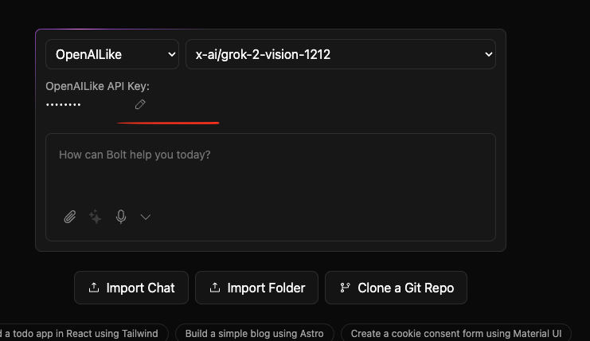
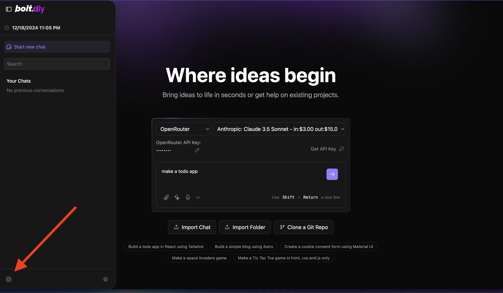
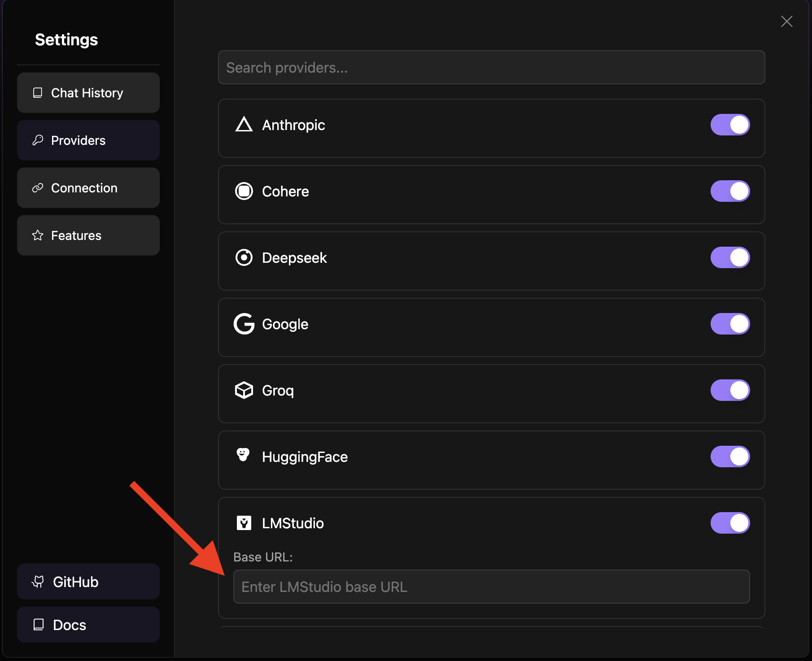

# bolt.diy (Previously oTToDev)

## Quick Download

[](https://github.com/stackblitz-labs/bolt.diy/releases/latest) ← Click here to go the the latest release version!

- Next **click source.zip**

## Prerequisites

Before you begin, you'll need to install two important pieces of software:

### Install Node.js

Node.js is required to run the application.

1. Visit the [Node.js Download Page](https://nodejs.org/en/download/)
2. Download the "LTS" (Long Term Support) version for your operating system
3. Run the installer, accepting the default settings
4. Verify Node.js is properly installed:
   - **For Windows Users**:
     1. Press `Windows + R`
     2. Type "sysdm.cpl" and press Enter
     3. Go to "Advanced" tab → "Environment Variables"
     4. Check if `Node.js` appears in the "Path" variable
   - **For Mac/Linux Users**:
     1. Open Terminal
     2. Type this command:
        ```bash
        echo $PATH
        ```
     3. Look for `/usr/local/bin` in the output

## Running the Application

You have two options for running Bolt.DIY: directly on your machine or using Docker.

### Option 1: Direct Installation (Recommended for Beginners)

1. **Install Package Manager (pnpm)**:

   ```bash
   npm install -g pnpm
   ```

2. **Install Project Dependencies**:

   ```bash
   pnpm install
   ```

3. **Start the Application**:

   ```bash
   pnpm run dev
   ```
   
### Option 2: Using Docker

This option requires some familiarity with Docker but provides a more isolated environment.

#### Additional Prerequisite

- Install Docker: [Download Docker](https://www.docker.com/)

#### Steps:

1. **Build the Docker Image**:

   ```bash
   # Using npm script:
   npm run dockerbuild

   # OR using direct Docker command:
   docker build . --target bolt-ai-development
   ```

2. **Run the Container**:
   ```bash
   docker compose --profile development up
   ```

## Configuring API Keys and Providers

### Adding Your API Keys

Setting up your API keys in Bolt.DIY is straightforward:

1. Open the home page (main interface)
2. Select your desired provider from the dropdown menu
3. Click the pencil (edit) icon
4. Enter your API key in the secure input field



### Configuring Custom Base URLs

For providers that support custom base URLs (such as Ollama or LM Studio), follow these steps:

1. Click the settings icon in the sidebar to open the settings menu
   

2. Navigate to the "Providers" tab
3. Search for your provider using the search bar
4. Enter your custom base URL in the designated field
   

> **Note**: Custom base URLs are particularly useful when running local instances of AI models or using custom API endpoints.

### Supported Providers

- Ollama
- LM Studio
- OpenAILike

## Setup Using Git (For Developers only)

This method is recommended for developers who want to:

- Contribute to the project
- Stay updated with the latest changes
- Switch between different versions
- Create custom modifications

#### Prerequisites

1. Install Git: [Download Git](https://git-scm.com/downloads)

#### Initial Setup

1. **Clone the Repository**:

   ```bash
   # Using HTTPS
   git clone https://github.com/stackblitz-labs/bolt.diy.git
   ```

2. **Navigate to Project Directory**:

   ```bash
   cd bolt.diy
   ```

3. **Switch to the Main Branch**:
   ```bash
   git checkout main
   ```
4. **Install Dependencies**:

   ```bash
   pnpm install
   ```

5. **Start the Development Server**:
   ```bash
   pnpm run dev
   ```

#### Staying Updated

To get the latest changes from the repository:

1. **Save Your Local Changes** (if any):

   ```bash
   git stash
   ```

2. **Pull Latest Updates**:

   ```bash
   git pull origin main
   ```

3. **Update Dependencies**:

   ```bash
   pnpm install
   ```

4. **Restore Your Local Changes** (if any):
   ```bash
   git stash pop
   ```

#### Troubleshooting Git Setup

If you encounter issues:

1. **Clean Installation**:

   ```bash
   # Remove node modules and lock files
   rm -rf node_modules pnpm-lock.yaml

   # Clear pnpm cache
   pnpm store prune

   # Reinstall dependencies
   pnpm install
   ```

2. **Reset Local Changes**:
   ```bash
   # Discard all local changes
   git reset --hard origin/main
   ```

Remember to always commit your local changes or stash them before pulling updates to avoid conflicts.

---

## Available Scripts

- **`pnpm run dev`**: Starts the development server.
- **`pnpm run build`**: Builds the project.
- **`pnpm run start`**: Runs the built application locally using Wrangler Pages.
- **`pnpm run preview`**: Builds and runs the production build locally.
- **`pnpm test`**: Runs the test suite using Vitest.
- **`pnpm run typecheck`**: Runs TypeScript type checking.
- **`pnpm run typegen`**: Generates TypeScript types using Wrangler.
- **`pnpm run deploy`**: Deploys the project to Cloudflare Pages.
- **`pnpm run lint:fix`**: Automatically fixes linting issues.

---

## Contributing

 [Contributing Guide](CONTRIBUTING.md)

---

## Roadmap

Explore upcoming features and priorities on our [Roadmap](https://roadmap.sh/r/ottodev-roadmap-2ovzo).

---

## FAQ

For answers to common questions, issues, and to see a list of recommended models, visit our [FAQ Page](FAQ.md).
